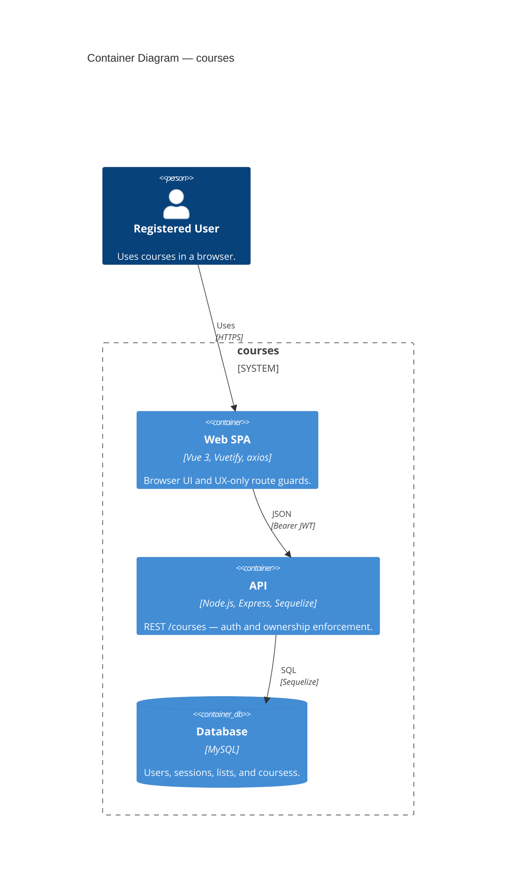

# C4 Level 2 — Containers

Monorepo split: browser SPA talks to a stateless REST API; API owns auth and `userId` scoping; MySQL holds rows.

## Notes

- API routes are mounted under `/courses/`; authenticated requests carry a Bearer JWT backed by the Session table.
- The API assigns and scopes ownership from `req.user.id`; the browser never supplies a trusted owner ID.
- Dev ports: frontend `8082` · backend `3200`; CORS origin must match the SPA.

**Related:** [project-structure.mdc](../../.cursor/rules/project-structure.mdc) · [api.md](../../features/reference/api.md)
